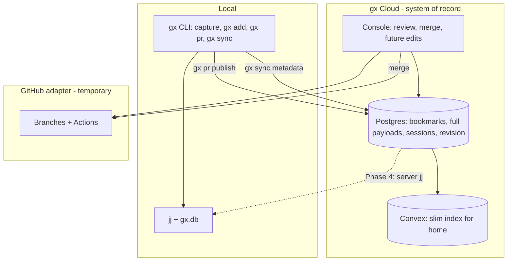

# gx Cloud Architecture Plan

## North star (locked decisions)




| Decision        | Choice                                                                                                                          |
| --------------- | ------------------------------------------------------------------------------------------------------------------------------- |
| VCS engine      | **Keep jj** (local now; server jj later)                                                                                        |
| Cloud origin    | **Postgres** (full bundles + sessions); Convex = thin index                                                                     |
| Home cards      | **One per bookmark**; `gx pr` again updates same card + "Updated …"                                                             |
| Sessions        | **Immutable content**; links/associations movable; console chat = same session shape (UI later)                                 |
| Dedup           | **Fix forward only** (no backfill merge of legacy rows)                                                                         |
| Merged PRs      | **Hidden by default**; show via filter                                                                                          |
| Home layout     | Flat by recency; **filter by repo** (exact UI from designs later)                                                               |
| Title           | Inferred + **user-editable** (schema now; UI when designs land)                                                                 |
| GitHub          | **Narrow adapter**: push branch, merge to default branch, read checks/SHA, detect external drift; **not** review/comment parity |
| CI              | **No product "modes"**; push triggers Actions; gx reads check runs via App permissions                                          |
| Merge           | **gx only**; propagate to GitHub once; detect if someone merged on GitHub externally                                            |
| Visitor reviews | **Separate future epic** (out of scope for this plan)                                                                           |


---

## Current state (baseline)

Already built and should be **preserved/refactored**, not rewritten:

- Ingest: `[services/api/src/routes/gx-pr.ts](services/api/src/routes/gx-pr.ts)` → `gx_pr_events` + `[sync-convex-push.ts](services/api/src/sync-convex-push.ts)`
- Review (Postgres): `[src/app/reviews/[id]/page.tsx](src/app/reviews/[id]/page.tsx)` + `[convex/gxReviewActions.ts](convex/gxReviewActions.ts)`
- Home (Convex-only, one card per push): `[src/components/pr/pr-console.tsx](src/components/pr/pr-console.tsx)` + `[convex/gxPr.ts](convex/gxPr.ts)`
- GitHub merge/status: `[convex/lib/gxPrGithub.ts](convex/lib/gxPrGithub.ts)` + `[convex/gxPrActions.ts](convex/gxPrActions.ts)`
- Session trimming for Convex: `[services/api/src/sync-convex-push.ts](services/api/src/sync-convex-push.ts)` `trimPushPayload()`

**Gaps:** no bookmark entity, home ignores Postgres, Convex stores full payloads, no CI check runs, no SHA drift, split review vs console UX, hardcoded canonical PR fallback in `gxPrGithub.ts`.

---

## Phase 0 — Land current work (prerequisite)

**Goal:** Merge in-flight console/gx PR features before schema/UI refactors.

- Ship existing merge bar, multi-file diffs, dev auth, Postgres ingest as-is
- Do **not** change bookmark model yet
- Document env: `DATABASE_URL`, `GX_CLOUD_API_KEY`, `GX_DEV_USER_ID`, `GX_WEBHOOK_SECRET`, GitHub OAuth

**Exit criteria:** `gx pr` → home shows pushes; review URL works; merge/reconcile on linked GitHub PR works for dogfood repos.

---

## Phase 1 — Postgres bookmark model + slim Convex

**Goal:** Postgres becomes authoritative for **current bookmark state**; Convex holds list metadata only; full sessions stay in Postgres.

### 1a. Schema migration

New migration `[services/api/migrations/003_gx_bookmarks.sql](services/api/migrations/003_gx_bookmarks.sql)`:

```sql
-- gx_bookmarks: one row per (user_id, repo, branch_name)
-- gx_pr_events: append-only audit (keep existing table)
```

`**gx_bookmarks` fields (minimum):**

- `id` UUID PK
- `user_id`, `repo_full_name`, `branch_name` (unique together)
- `title` TEXT (nullable; inferred on first publish)
- `revision` INT NOT NULL DEFAULT 1
- `latest_event_id` UUID FK → `gx_pr_events.id`
- `head_commit_id`, `github_pr_url`, `github_pr_number`
- `remote_head_sha` TEXT (last known GitHub tip)
- `merge_status` TEXT (`open` | `merged` | `closed`)
- `merged_at_ms`, `published_at_ms`, `updated_at_ms`
- `storage_backend` TEXT DEFAULT `'github'`

Keep `**payload` only on `gx_pr_events`** (audit). Bookmark row does **not** duplicate full JSON.

### 1b. Ingest upsert (fix forward)

Update `[services/api/src/routes/gx-pr.ts](services/api/src/routes/gx-pr.ts)`:

1. INSERT `gx_pr_events` (unchanged audit behavior)
2. UPSERT `gx_bookmarks` on `(user_id, repo_full_name, branch_name)`:
  - bump `revision`, set `latest_event_id`, `head_commit_id`, `github_pr_url`, `updated_at_ms`
  - infer `title` from first stack change description or branch slug if null
3. Sync **slim record** to Convex (not full payload)

### 1c. Slim Convex schema

Update `[convex/schema.ts](convex/schema.ts)` — replace or add `gxBookmarks` table:

```ts
{
  userId, postgresBookmarkId, repoFullName, branchName,
  title?, revision, updatedAt, mergeStatus,
  githubPrUrl?, headCommitId?, remoteHeadSha?,
  latestEventId  // Postgres UUID for detail fetch
}
```

Deprecate storing `payload: v.any()` on new ingests. Migrate `listMyPushes` → `listMyBookmarks` in `[convex/gxPr.ts](convex/gxPr.ts)`.

Update `[services/api/src/sync-convex-push.ts](services/api/src/sync-convex-push.ts)`:

- **Remove** `trimPushPayload` for sessions (no payload to Convex)
- Pass bookmark index fields + `latestEventId` only

Remove or gate duplicate untrimmed ingest via `[convex/http.ts](convex/http.ts)` `POST /gx/pr` (prefer single ingest path through gx-cloud API).

### 1d. API: list bookmarks

Add to `[services/api/src/routes/events.ts](services/api/src/routes/events.ts)` or new `bookmarks.ts`:

- `GET /bookmarks` — list for auth user, sort `updated_at_ms DESC`, query params: `merge_status`, `repo_full_name`
- `GET /bookmarks/:id` — bookmark metadata + optional `?include_payload=1` joins latest event

Expose to Console via Convex action (mirror `[gxReviewActions.ts](convex/gxReviewActions.ts)` pattern) e.g. `listMyBookmarks`, `getBookmarkDetail`.

**Exit criteria:** New `gx pr` on same branch updates one bookmark row; Convex row updates in place; Postgres event log grows; sessions remain full in latest event payload.

---

## Phase 2 — Unified Console home (one card per bookmark)

**Goal:** Single review surface; home reads Postgres-backed bookmarks; detail loads full payload from Postgres.

### 2a. Home refactor

Update `[src/components/pr/pr-console.tsx](src/components/pr/pr-console.tsx)`:

- Query `listMyBookmarks` (not `listMyPushes`)
- Default filter: `merge_status=open`
- Add filters: **Merged**, **Group by repo** (structure only; visual polish deferred to design handoff)
- Card label: `title` + repo + relative **Updated …** from `updatedAt`
- Card key: bookmark id (stable across publishes)

### 2b. Unify detail view

- Load detail via `getBookmarkDetail` → Postgres `latest_event_id` payload
- Reuse `[PrPushPreview](src/components/pr/pr-push-preview.tsx)` + `[PrMergeBar](src/components/pr/pr-merge-bar.tsx)`
- Point merge bar at bookmark id + `latestEventId` (update `[convex/gxPrActions.ts](convex/gxPrActions.ts)` args)
- Redirect or link `[/reviews/[id]](src/app/reviews/[id]/page.tsx)` → console bookmark view (same component, id = bookmark or event with redirect)

### 2c. Title editing

- API: `PATCH /bookmarks/:id` `{ title }` + bump revision
- Convex mutation wrapper; UI: minimal inline edit (placeholder until designs)

### 2d. Multi-repo

- Home query returns all bookmarks for user across connected repos (`[convex/repos.ts](convex/repos.ts)` / `connectedRepos` already exist for onboarding)
- Repo filter = client or server filter on `repo_full_name`

**Exit criteria:** Two `gx pr` on same branch → one sidebar card, updated timestamp; merged bookmarks hidden unless filter on; review and home share one diff/merge experience.

---

## Phase 3 — GitHub adapter (narrow boundary)

**Goal:** Support Actions + hybrid teams without GitHub-as-review-surface.

### 3a. App permissions

Document and configure GitHub App (existing app in `[.env.example](.env.example)`):


| Permission             | Purpose                                        |
| ---------------------- | ---------------------------------------------- |
| `contents: read/write` | Push branches; merge to default branch         |
| `pull_requests: read`  | PR metadata, mergeability (optional PR object) |
| `checks: read`         | Check runs on head SHA                         |
| `actions: read`        | Workflow run visibility                        |
| `actions: write`       | (Optional v1) Re-run failed checks from gx     |


User OAuth (`[convex/githubAccess.ts](convex/githubAccess.ts)`) remains for user-token operations; App installation token for org repos where applicable (`[getGithubAppToken.ts](convex/lib/turbopuffer/getGithubAppToken.ts)` pattern).

### 3b. Read CI status

Extend `[convex/lib/gxPrGithub.ts](convex/lib/gxPrGithub.ts)`:

- `getCheckStatusForRef(repo, sha)` → aggregate: pending / success / failure
- Include in `getPullRequestStatus` response
- Update `[pr-merge-bar.tsx](src/components/pr/pr-merge-bar.tsx)`: show **CI** badge separate from mergeable/clean
- Optional merge gate: block when required checks failing (configurable later)

### 3c. Drift detection

Add to GitHub adapter:

- `getRemoteBranchSha(repo, branch)` (partially exists via ref API)
- Compare to bookmark `head_commit_id` / last published SHA
- Surface in merge bar: **In sync** | **GitHub ahead** (external push) | **gx ahead**
- On external merge: webhook or poll `pull_request` closed + merged → set `merge_status=merged` on bookmark

Remove hardcoded canonical PR fallback (`gx/session-zz27lkk4`) in `[gxPrGithub.ts](convex/lib/gxPrGithub.ts)` once bookmarks carry `github_pr_number`.

### 3d. Merge propagation (gx-only)

Keep current flow in `[mergePullRequestOnGithub](convex/lib/gxPrGithub.ts)` for v1:

- gx merge → GitHub PR merge API → update bookmark `merge_status`, `merged_at_ms`
- Future: storage-only path (`integrateMerge` push to `main` without PR) behind `storage_backend` — **interface only in this phase**, implement when dropping PR requirement

Define TypeScript interface (new file):

`[convex/lib/codeStorageAdapter.ts](convex/lib/codeStorageAdapter.ts)`

```ts
interface CodeStorageAdapter {
  publish(bookmark): Promise<{ remoteSha: string }>
  integrateMerge(bookmark): Promise<void>
  fetchStatus(bookmark): Promise<{ remoteSha; checks; mergeable }>
}
```

`GitHubAdapter` implements it; Console/merge bar depend on interface.

**Explicitly out of scope:** GitHub review comments, CODEOWNERS UI, GitHub merge button UX, bidirectional comment sync.

**Exit criteria:** Merge bar shows CI state; external GitHub merge marks bookmark merged in gx; drift visible when branch SHA differs.

---

## Phase 4 — Server jj foundation (prep for cloud mutations)

**Goal:** Single jj mutation engine on server; `gx sync` stays metadata-first; GitHub export from server.

*Defer implementation until Phases 1–3 stable; include in plan for multitask sequencing.*

### 4a. Workspace service (new)

New package or service e.g. `[services/jj-worker/](services/jj-worker/)`:

- Colocated jj clone per `(userId, repoFullName)` — warm pool
- API: `applyBookmarkRevision(bookmarkId, ops[])` — wraps jj commands
- On success: push via `jj git push --bookmark`, update bookmark `remote_head_sha`, bump revision

### 4b. Console save pipeline (stub → implement)

- Console structural save → Postgres revision bump + queue jj job
- Until worker exists: **CLI `gx pr` remains publish path**; console read-only for stack edits

### 4c. gx sync contract (document + CLI follow-up in gx repo)

- `gx sync` pulls: bookmark list, revision, session associations, new console sessions
- Local jj catch-up: `jj git fetch` when `remote_head_sha` ≠ local bookmark tip
- Conflict policy: **separate design doc** (next discussion); do not block Phases 1–3

**Exit criteria:** One server-side jj operation (e.g. restack) applied in dev; GitHub branch matches; `gx sync` receives new revision without full payload replay.

---

## Phase 5 — Future (track only, not this multitask)


| Epic                        | Notes                                                                                            |
| --------------------------- | ------------------------------------------------------------------------------------------------ |
| **Visitor reviews**         | Share link, read-only review, optional comments as new session rows; no GitHub write             |
| **Console chat → sessions** | Append-only session ingest API matching `[PushBundle.sessions](services/api/src/types.ts)` shape |
| **Console stack edits**     | Requires Phase 4 server jj                                                                       |
| **gx-owned CI**             | Blacksmith-like runners; same check status shape as GitHub adapter                               |
| **Replace GitHub storage**  | New `CodeStorageAdapter` impl; jj remains engine                                                 |


---

## File touch map (by phase)


| Phase | Primary files                                                                                                                    |
| ----- | -------------------------------------------------------------------------------------------------------------------------------- |
| 1     | `services/api/migrations/003_*.sql`, `gx-pr.ts`, `sync-convex-push.ts`, `convex/schema.ts`, `convex/gxPr.ts`, `convex-client.ts` |
| 2     | `pr-console.tsx`, `pr-merge-bar.tsx`, `gxReviewActions.ts` (+ new list actions), `reviews/[id]/page.tsx`, `gx-pr-payload.ts`     |
| 3     | `gxPrGithub.ts`, `gxPrActions.ts`, `pr-merge-bar.tsx`, new `codeStorageAdapter.ts`, `.env.example`                               |
| 4     | New `services/jj-worker/`, bookmark API extensions                                                                               |


---

## Testing plan

- **Phase 1:** `gx pr` twice same branch → 2 events, 1 bookmark, revision=2; Convex single index row; latest event has full sessions
- **Phase 2:** Home shows one card; merged filter; title PATCH persists
- **Phase 3:** Mock check runs API; simulate external SHA change → drift badge; merge on GitHub → bookmark merged in gx
- **Regression:** Dev bypass auth; multi-file diff preview; merge draft PR (mark ready + merge)

---

## Risks and mitigations


| Risk                                   | Mitigation                                                                                |
| -------------------------------------- | ----------------------------------------------------------------------------------------- |
| Convex/Postgres drift during migration | Single ingest path through gx-cloud; bookmark upsert + slim sync atomically               |
| Legacy duplicate cards                 | Fix forward only; old pushes remain in events table, invisible once bookmark upsert runs  |
| GitHub App vs user OAuth               | Use App for checks/push on org repos; user token for personal repos (document in Phase 3) |
| Server jj scope creep                  | Phase 4 explicitly deferred; Phases 1–3 shippable without it                              |
| Design handoff changes UI              | Schema/API stable; filters and layout swappable in `pr-console.tsx`                       |


---

## Multitask model routing

| Phase | Model | Parallel? |
|-------|--------|-----------|
| 0 — Land current work | GPT 5.5 | No |
| 1 — Postgres + slim Convex | GPT 5.3 Codex | No (sequential spine) |
| 2 — Console home + unify | GPT 5.3 Codex | Yes (UI vs wiring after Phase 1) |
| 3 — GitHub adapter | GPT 5.3 Codex | Yes (API vs adapter interface) |
| 4 — jj-worker (deferred) | GPT 5.5 scaffold, Codex implement | No |
| 5 — Future epics | **Out of scope** — saved for later | — |

Phase 5 (visitor reviews, console chat sessions, gx CI, replace GitHub) is explicitly not part of the current multitask work.
